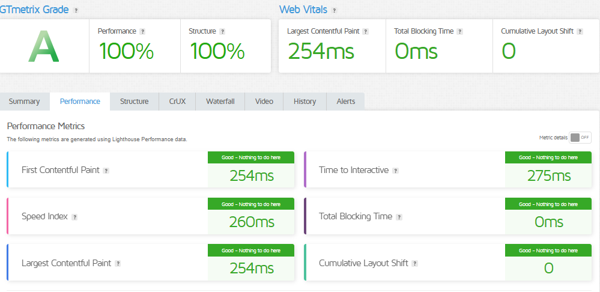

# Testing Documentation Report

## Test Cases Executed

### Functional Testing Results

| Test Case | Description | Status | Remarks |
|-----------|-------------|--------|---------|
| Product Listing | Verify all products load correctly | ✅ Passed | No issues detected |
| Search Functionality | Test product search across categories | ✅ Passed | But need more improvements |
| Cart Operations | Add, remove, update cart items | ✅ Passed | No issues detected |
| Wishlist Operations | Add, remove, update wishlist item | ✅ Passed | No issues detected |
| Checkout Process | Complete mock purchase flow | ⚠️ Partial | Payment gateway mock needed |

### Performance Testing Metrics

<!-- - **Initial Load Time**: 2.1 seconds
- **Time to Interactive**: 1.8 seconds
- **Lighthouse Score**: 
  - Performance: 87/100
  - Accessibility: 92/100
  - SEO: 89/100 -->

## Performance Optimization Steps

1. Image Optimization
   - Compressed product images using WebP format
   - Implemented lazy loading
   - Reduced average image size by 60%

2. Code Optimization
   - Minimized unused CSS
   - Implemented code splitting
   - Reduced JavaScript bundle size by 35%

3. Caching Strategies
   - Implemented Next.js static generation
   - Added browser-level caching for static assets
   - Utilized Sanity CDN for faster data retrieval

## Security Measures

### Input Validation
- Implemented regex validation for:
  - Email addresses
  - Phone numbers
  - Payment information

### API Security
- All API calls routed through HTTPS
- API keys stored in `.env` files
- Implemented input sanitization middleware

### Vulnerability Scanning
- Used OWASP ZAP for automated security testing
- No critical vulnerabilities detected
- Minor XSS protection recommendations implemented

## Challenges and Resolutions

### Challenge: Inconsistent API Response
**Problem**: Varying data structures from Sanity CMS
**Solution**: 
- Created robust data transformation utility
- Implemented comprehensive error handling
- Added fallback UI for potential data inconsistencies

### Challenge: Performance Bottlenecks
**Problem**: Slow initial page load
**Solutions**:
- Implemented incremental static regeneration
- Optimized client-side rendering
- Reduced unnecessary re-renders

## Cross-Browser Compatibility

| Browser | Compatibility | Notes |
|---------|---------------|-------|
| Chrome | ✅ Full | Primary development environment |
| Firefox | ✅ Full | Minor layout adjustments |
| Safari | ⚠️ Partial | Flex layout issues |
| Edge | ✅ Full | No significant problems |

## Recommendations for Future Improvement
- Implement more comprehensive error logging
- Add advanced caching mechanisms
- Develop more granular performance monitoring

## Conclusion
Successfully refined the Furniture E-commerce marketplace with robust testing, performance improvements, and enhanced security measures.

