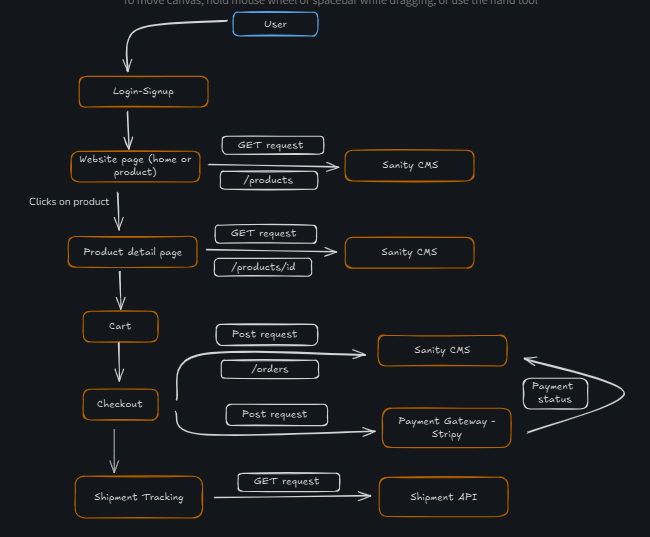

# Marketplace Technical Foundation - Furniture Website

This furniture website provides users with a seamless shopping experience to browse and purchase furniture items. It combines a responsive frontend with dynamic backend capabilities powered by Sanity CMS to ensure efficient content management and order processing.

## 1. System Architecture Overview

### Component Roles

- **Frontend (Next.js)**:

  - Provides a user interface for browsing furniture, viewing details, and placing orders.
  - Implements responsive design for all devices.
  - Communicates with APIs to fetch data and process user actions.

- **Sanity CMS**:

  - Acts as the backend for managing data such as products, categories, and orders.
  - Provides APIs for querying and updating content.

- **Third-Party APIs**:

  - **Payment Gateway API**: Handles secure transactions.
  - **Shipping API**: Manages order tracking and delivery details.

 

---

## 2. Key Workflows

### 2.1 User Browses Products

1. User visits the homepage.
2. The frontend sends a `GET` request to the Sanity CMS API to fetch product categories and featured items.
3. Categories and products are displayed dynamically on the site.

### 2.2 Product Details

1. User clicks on a product.
2. The frontend makes a `GET` request to fetch detailed information (e.g., dimensions, price, availability).
3. Data is rendered dynamically, including images and reviews.

### 2.3 Add to Cart and Checkout

1. User adds a product to the cart (stored locally or sent to the backend).
2. At checkout, user details and cart items are sent to the Sanity CMS API (`POST /orders`).
3. Payment information (e.g., card details) is sent directly from the frontend to the Payment Gateway API.
4. Once payment is confirmed, the status is updated in Sanity CMS.
5. Confirmation is sent to the user and recorded in the CMS.

### 2.4 Order Processing

1. Order data is saved in Sanity CMS.
2. Shipping details are fetched using the Shipping API.
3. The user is notified of the order status via email or a notification system.

 

---

## 3. API Endpoints

### General Endpoints

| Endpoint         | Method | Purpose                                                                   |
| ---------------- | ------ | -------------------------------- |
| `/products`      | GET    | Fetch all product details        | 
| `/products/{id}` | GET    | Fetch details of a specific item |
| `/orders`        | POST   | Create a new order               |
| `/shipment`      | GET    | Track order delivery status      |

---